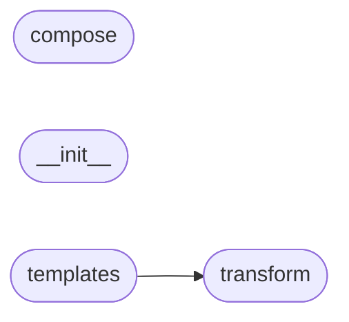

# Code Overview

[_Documentation generated by Documatic_](https://www.documatic.com)

<!---Documatic-section-Codebase Structure Python-start--->
## Codebase Structure Python

The codebase has a flat structure, with 4 code files.

<!---Documatic-block-system_architecture-start--->

<!---Documatic-block-system_architecture-end--->

# #
<!---Documatic-section-Codebase Structure Python-end--->

<!---Documatic-section-File IO-start--->
## File IO

<!---Documatic-block-file_io-start--->
The following files have file read operations

<!---Documatic-block-src.svgutils-start--->

	
<code>src.svgutils</code> (Click to Expand!)

* src.svgutils.compose
* src.svgutils.transform

<!---Documatic-block-src.svgutils-end--->

The following files have file write operations

<!---Documatic-block-src.svgutils-start--->

	
<code>src.svgutils</code> (Click to Expand!)

* src.svgutils.transform

<!---Documatic-block-src.svgutils-end--->
<!---Documatic-block-file_io-end--->

# #
<!---Documatic-section-File IO-end--->

<!---Documatic-section-Class Hierarchy-start--->
## Class Hierarchy

<!---Documatic-block-object-start--->

	
<code>object</code> (Click to Expand!)

* src.svgutils.transform.FigureElement
* src.svgutils.transform.SVGFigure

<!---Documatic-block-object-end--->

<!---Documatic-block-src.svgutils.compose.Panel-start--->

	
<code>src.svgutils.compose.Panel</code> (Click to Expand!)

* src.svgutils.compose.Figure

<!---Documatic-block-src.svgutils.compose.Panel-end--->

<!---Documatic-block-src.svgutils.compose.SVG-start--->

	
<code>src.svgutils.compose.SVG</code> (Click to Expand!)

* src.svgutils.compose.MplFigure

<!---Documatic-block-src.svgutils.compose.SVG-end--->

<!---Documatic-block-src.svgutils.templates.BaseTemplate-start--->

	
<code>src.svgutils.templates.BaseTemplate</code> (Click to Expand!)

* src.svgutils.templates.ColumnLayout
* src.svgutils.templates.VerticalLayout

<!---Documatic-block-src.svgutils.templates.BaseTemplate-end--->

<!---Documatic-block-src.svgutils.transform.FigureElement-start--->

	
<code>src.svgutils.transform.FigureElement</code> (Click to Expand!)

* src.svgutils.compose.Image
* src.svgutils.compose.Panel
* src.svgutils.compose.SVG
* src.svgutils.compose.Text
* src.svgutils.transform.GroupElement
* src.svgutils.transform.ImageElement
* src.svgutils.transform.LineElement
* src.svgutils.transform.TextElement

<!---Documatic-block-src.svgutils.transform.FigureElement-end--->

<!---Documatic-block-src.svgutils.transform.SVGFigure-start--->

	
<code>src.svgutils.transform.SVGFigure</code> (Click to Expand!)

* src.svgutils.templates.BaseTemplate

<!---Documatic-block-src.svgutils.transform.SVGFigure-end--->

# #
<!---Documatic-section-Class Hierarchy-end--->

[_Documentation generated by Documatic_](https://www.documatic.com)