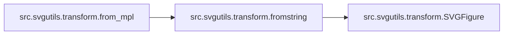

# Src Svgutils Transform

[_Documentation generated by Documatic_](https://www.documatic.com)

<!---Documatic-section-Codebase Structure-start--->
## Codebase Structure

<!---Documatic-block-system_architecture-start--->
```mermaid
None
```
<!---Documatic-block-system_architecture-end--->

# #
<!---Documatic-section-Codebase Structure-end--->

<!---Documatic-section-src.svgutils.transform.fromfile-start--->
## [src.svgutils.transform.fromfile](3-src_svgutils_transform.md#src.svgutils.transform.fromfile)

<!---Documatic-section-fromfile-start--->


### Object Calls

* src.svgutils.transform.SVGFigure

<!---Documatic-block-src.svgutils.transform.fromfile-start--->
<details>
	<summary><code>src.svgutils.transform.fromfile</code> code snippet</summary>

```python
def fromfile(fname):
    fig = SVGFigure()
    with open(fname) as fid:
        svg_file = etree.parse(fid, parser=etree.XMLParser(huge_tree=True))
    fig.root = svg_file.getroot()
    return fig
```
</details>
<!---Documatic-block-src.svgutils.transform.fromfile-end--->
<!---Documatic-section-fromfile-end--->

# #
<!---Documatic-section-src.svgutils.transform.fromfile-end--->

<!---Documatic-section-src.svgutils.transform.fromstring-start--->
## [src.svgutils.transform.fromstring](3-src_svgutils_transform.md#src.svgutils.transform.fromstring)

<!---Documatic-section-fromstring-start--->


### Object Calls

* src.svgutils.transform.SVGFigure

<!---Documatic-block-src.svgutils.transform.fromstring-start--->
<details>
	<summary><code>src.svgutils.transform.fromstring</code> code snippet</summary>

```python
def fromstring(text):
    fig = SVGFigure()
    svg = etree.fromstring(text.encode(), parser=etree.XMLParser(huge_tree=True))
    fig.root = svg
    return fig
```
</details>
<!---Documatic-block-src.svgutils.transform.fromstring-end--->
<!---Documatic-section-fromstring-end--->

# #
<!---Documatic-section-src.svgutils.transform.fromstring-end--->

<!---Documatic-section-src.svgutils.transform.from_mpl-start--->
## [src.svgutils.transform.from_mpl](3-src_svgutils_transform.md#src.svgutils.transform.from_mpl)

<!---Documatic-section-from_mpl-start--->


### Object Calls

* [src.svgutils.transform.fromstring](3-src_svgutils_transform.md#src.svgutils.transform.fromstring)

<!---Documatic-block-src.svgutils.transform.from_mpl-start--->
<details>
	<summary><code>src.svgutils.transform.from_mpl</code> code snippet</summary>

```python
def from_mpl(fig, savefig_kw=None):
    fid = StringIO()
    if savefig_kw is None:
        savefig_kw = {}
    try:
        fig.savefig(fid, format='svg', **savefig_kw)
    except ValueError:
        raise (ValueError, 'No matplotlib SVG backend')
    fid.seek(0)
    fig = fromstring(fid.read())
    (w, h) = fig.get_size()
    fig.set_size((w.replace('pt', ''), h.replace('pt', '')))
    return fig
```
</details>
<!---Documatic-block-src.svgutils.transform.from_mpl-end--->
<!---Documatic-section-from_mpl-end--->

# #
<!---Documatic-section-src.svgutils.transform.from_mpl-end--->

[_Documentation generated by Documatic_](https://www.documatic.com)